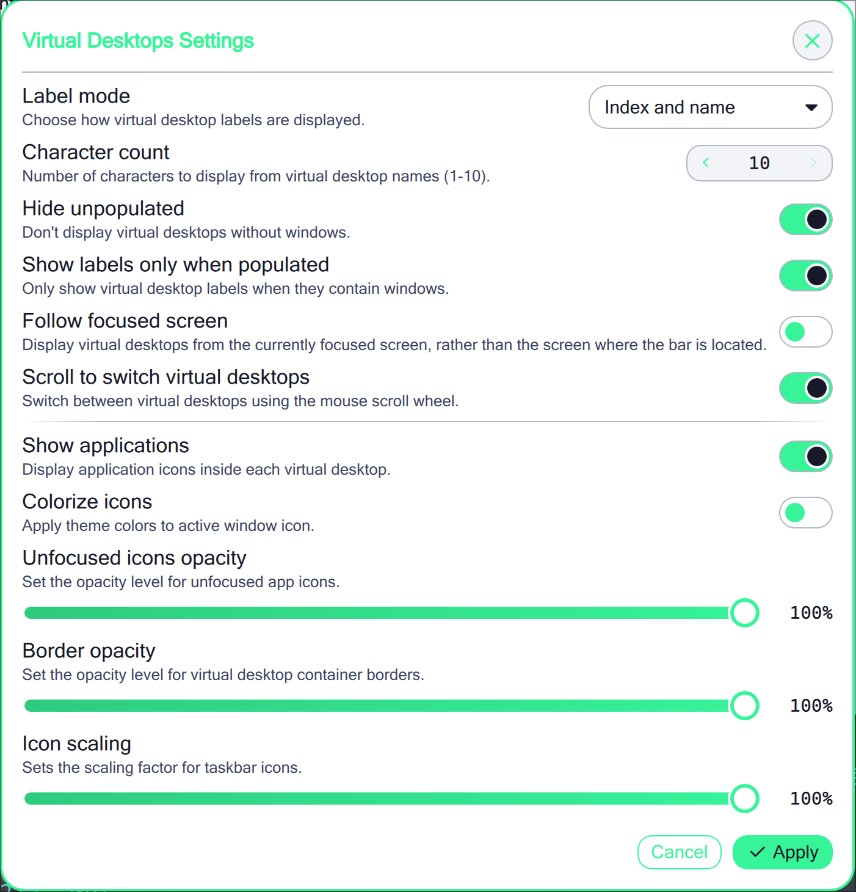

# Virtual Desktops

A noctalia plugin for [hyprland virtual desktops](https://github.com/levnikmyskin/hyprland-virtual-desktops)

> Shameful plagiarism of the official Workspace implementation

## Usage

### Installation from plugin registry

TODO, only manual installation is supported for now.

### Manual Installation

1. `git clone https://github.com/AbaoFromCUG/noctalia-virtual-desktops ~/.config/noctalia/plugins/noctalia-virtual-desktops`
2. Restart `noctalia`, then enable `Virtual Desktops` in Noctalia's plugin settings
3. Add `Virtual Desktops` to your bar
4. Open the plugin settings

## Requirements

- Noctalia 3.6.0 or later
- Hyprland
- [hyprland-virtual-desktops](https://github.com/levnikmyskin/hyprland-virtual-desktops)

## Showcase

- Virtual Desktop with Name Display

- Virtual Desktop with Application Display

- Plugin Settings

## TODO

- [ ] Support [widget settings](https://docs.noctalia.dev/development/widget/#1-create-modulespanelssettingsbarwidgetsettingshelloworldsettingsqml)
- [ ] Add more i18n translation, contributions welcome!
- [ ] Register on Noctalia's official plugin registry or third-party plugin repositories, avoiding manual installation.
